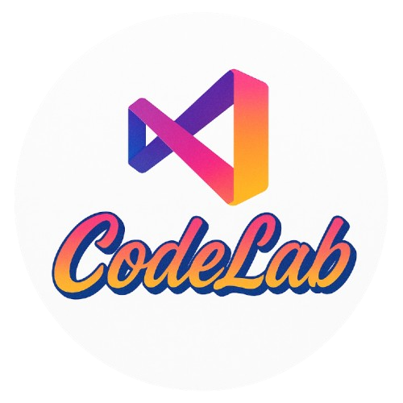

# CodeLab VS Code Extension

<p align="center">
  
</p>

CodeLab is a Visual Studio Code extension that transforms markdown files (`.mdcl`) into interactive command execution environments. Perfect for creating executable documentation, tutorials, training materials, technical runbooks, and interactive quizzes with live command execution capabilities.

## Works With

- Visual Studio Code 1.85.0 or higher
- [Cursor](https://cursor.so)
- [Windsurf](https://windsurf.dev)
- [Code Server](https://github.com/coder/code-server) - must enable `Insecure origins treated as secure` setting in browser for the address if you are using HTTPS

## Features

### Interactive Markdown Commands
CodeLab extends standard markdown with special command tags that become executable:

- **Execute in Terminal**: Run commands in VS Code's integrated terminal with visual feedback
- **Copy to Clipboard**: Click to copy code snippets directly to clipboard
- **Open Files**: Open files relative to the current document or workspace
- **Terminal Targeting**: Execute commands in specific named terminal instances
- **Block Execution**: Run multiple commands with a single button
- **Execution Tracking**: Visual indicators (green checkmark) for executed commands
- **Admonitions**: Styled callout boxes for notes, tips, warnings, and danger alerts
- **Interactive Quizzes**: Create multiple-choice quizzes with answer key validation

### Command Syntax

See the `command-examples.mdcl` file for a comprehensive demonstration of all features. Below are quick reference examples:

#### Individual Commands

Embed executable commands in markdown using backticks and action tags:

- Wrapping single commands:

```
`echo "Hello World"` {{ execute }}
```

- Executing a command in the main CodeLab terminal:
```
`npm install` {{ execute }}
```

- Executing in a named terminal (e.g., 't2' 't3', etc.):
```
`npm test` {{ execute 't2' }}
```

- Opening files in VSCode editor relative to the current file or workspace:
```
`./src/main.ts` {{ open }}
```

- Copying code snippets to clipboard:
```
`const data = []` {{ copy }}
```

- Interrupting current command before executing a new one:
```
`npm start` {{ execute interrupt }}  # Interrupt current process first
```


#### Multi-line Commands in Code Blocks

Create code blocks with multiple executable commands, each with its own button:

````markdown
```
`echo "First command"` {{ execute }}
`echo "Second command"` {{ execute }}
`echo "Third command"` {{ execute }}
```
````

#### Block Execution (Run All)

Execute multiple commands with a single "Run All" button:

```{{ execute }}
echo "Command 1"
echo "Command 2"
echo "Command 3"
```

#### Admonitions

Add styled callout boxes for different types of contextual information:

```
`General information` {{ note }}
`Technical details` {{ info }}
`Helpful tip` {{ tip }}
`Important caution` {{ warning }}
`Critical alert` {{ danger }}
```

Each admonition type has distinct colors, icons, and styling to draw attention appropriately.

#### Interactive Quizzes

Create multiple-choice quizzes with answer validation:

**Block format:**
````
```quiz id="unique-id"
Q: What is the question?
A) Option A
B) Option B
C) Option C
D) Option D
```
````

**Inline format:**
```
`What is your question?` {{ quiz id="unique-id" }}
```

**Answer Key File** (`.mdclanswer.yaml`):
```yaml
quizzes:
  unique-id:
    answer: "B"
    explanation: "Optional explanation text"
```


### Live Preview Panel
- Automatically opens when viewing `.mdcl` files
- Side-by-side view with the source markdown
- Interactive command buttons with hover effects
- Auto-refresh on document changes
- Maintains scroll position when switching tabs
- Visual execution tracking with green checkmarks
- Styled code blocks with syntax highlighting
- Hugo LoveIt theme-inspired admonition styling
- Real-time quiz validation and feedback

### CodeLens Integration
- Inline executable commands appear as CodeLens hints above the code
- Click to run, copy, or open files directly from the editor
- Support for terminal targeting and interrupt commands
- Toggle visibility via extension settings

## Requirements

- Visual Studio Code version 1.85.0 or higher
- Node.js and npm (for development and building)

## Installation

### From VSIX Package
1. Download or build the `codelabv2-1.1.0.vsix` file
2. Install using one of these methods:
   - **Command line**: `code --install-extension codelabv2-1.1.0.vsix`
   - **VS Code GUI**:
     1. Open Extensions view (`Cmd+Shift+X` / `Ctrl+Shift+X`)
     2. Click `...` menu → `Install from VSIX...`
     3. Select the `codelabv2-1.1.0.vsix` file

### Building from Source
```bash
# Clone the repository
git clone https://github.com/mjtechguy/codelabv2.git
cd codelabv2

# Install dependencies
npm install

# Build the extension (bundles all dependencies)
npm run package
npx @vscode/vsce package

# Install the generated VSIX
code --install-extension codelabv2-1.1.0.vsix
```

## Extension Settings

Configure CodeLab through VS Code settings:

| Setting | Description | Default |
|---------|-------------|---------|
| `mdcl.enableCodeLens` | Enable/disable CodeLens for executable commands | `true` |
| `mdcl.autoOpenPreview` | Automatically open preview for `.mdcl` files | `true` |
| `mdcl.openRelative` | Basis for opening files using relative paths | `"File"` |
| | • `"File"`: Relative to the current markdown file | |
| | • `"Workspace"`: Relative to the workspace folder | |
| `mdcl.interruptDelay` | Delay (ms) between interrupt signal and new command | `200` |

## Architecture

CodeLab is built with:
- **TypeScript** for type safety and better IDE support
- **VS Code Extension API** for deep editor integration
- **Marked.js** for markdown parsing and rendering
- **WebView API** for the interactive preview panel
- **CodeLens Provider** for inline command execution
- **YAML** for quiz answer key parsing
- **esbuild** for bundling dependencies into a single output file

## File Format

CodeLab uses `.mdcl` files (Markdown CodeLab) which are standard markdown files with embedded executable commands. The extension automatically activates when opening `.mdcl` files.

## Terminal Management

- Commands execute in terminals named "CodeLab - main" by default
- Create named terminals with `{{ execute 'terminalName' }}`
- Terminals persist across command executions
- Use `{{ execute interrupt }}` to send Ctrl+C before executing

## Features in Detail

### Execution Tracking
- Buttons show a green border and checkmark when executed
- Each button tracks independently (even duplicate commands)
- State persists within the current session

### Scroll Position Persistence
- Preview maintains scroll position when switching tabs
- Automatically restores position when returning to preview

### Block Commands
- Wrap multiple commands in eval to reduce terminal echo
- Commands are joined with `&&` for sequential execution
- Single "Run All" button for entire block

## Release Notes

### 1.1.0

**New Features:**
- **Admonitions**: Five types of styled callout boxes (note, info, tip, warning, danger) with Hugo LoveIt theme-inspired styling
- **Interactive Quizzes**: Create multiple-choice quizzes with answer key validation using `.mdclanswer.yaml` files
- **Answer Key Loader**: Secure YAML-based answer key system for quiz validation
- **esbuild Integration**: Extension now properly bundles all dependencies for reliable installation

**Improvements:**
- Enhanced preview panel with quiz feedback UI
- Better error handling for missing answer keys
- Improved documentation with comprehensive `command-examples.mdcl`

### 1.0.0

**Initial Release:**
- Interactive markdown command execution with `.mdcl` files
- Live preview panel with auto-open support
- CodeLens integration for inline execution
- Multi-terminal support with named terminals
- Visual execution tracking with green indicators
- Scroll position persistence
- Block command execution
- File opening with configurable paths
- Copy to clipboard functionality

## Development

### Project Structure
```
codelab-v2/
├── src/
│   ├── extension.ts          # Extension entry point
│   ├── previewPanel.ts       # Preview panel with webview
│   ├── commandExecutor.ts    # Command execution logic
│   ├── commandParser.ts      # Command parsing from markdown
│   ├── codeLensProvider.ts   # CodeLens provider
│   ├── quizProcessor.ts      # Quiz parsing and rendering
│   ├── answerKeyLoader.ts    # Answer key YAML loader
│   └── types/                # TypeScript type definitions
├── syntaxes/
│   └── mdcl.tmLanguage.json  # Syntax highlighting for .mdcl
├── icons/                     # Extension and file icons
├── package.json               # Extension manifest
├── tsconfig.json              # TypeScript configuration
├── esbuild.js                 # Build bundler configuration
└── command-examples.mdcl      # Comprehensive feature documentation
```

### Building the Extension

```bash
# Install dependencies
npm install

# Bundle extension with esbuild (production)
npm run package

# Build VSIX package
npx @vscode/vsce package

# Watch for changes during development
npm run compile:watch

# Compile TypeScript (without bundling)
npm run compile
```

### Testing

1. Press `F5` in VS Code to launch a new Extension Development Host
2. Create a `.mdcl` file to test the features
3. Use the preview panel and CodeLens to execute commands

## Contributing

Contributions are welcome! Please feel free to submit a Pull Request.

## License

This project is licensed under the MIT License.

---

**Enjoy creating interactive documentation with CodeLab!**
